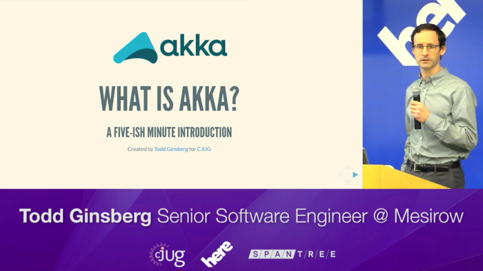

# What Is Akka?
A 5-ish minute introduction to Akka. This is lightning talk I gave at a Chicago Java Users Group meeting. It was my first time doing any kind of public speaking.

### Slide Show

This slides for this presentation can be [viewed here](https://tginsberg.github.io/what-is-akka).

### Video

The folks at [Spantree](http://www.spantree.net/) were nice enough to record and host a video of the presentation. Check it out below!

